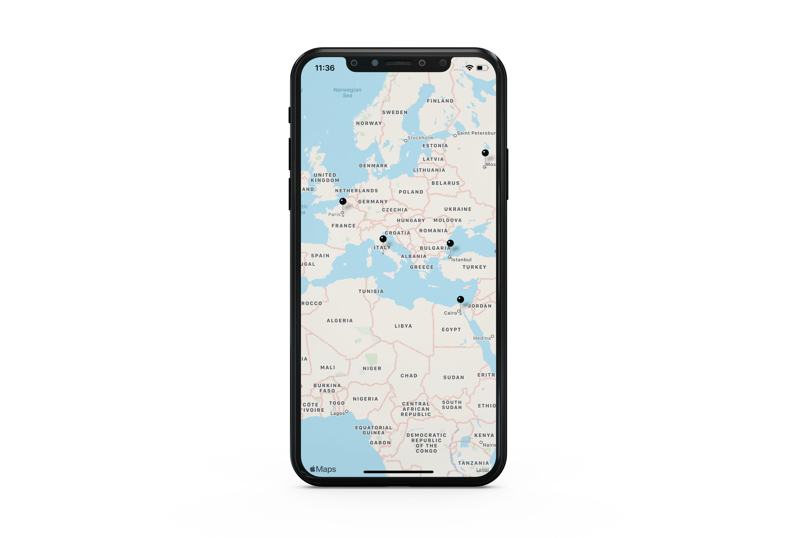
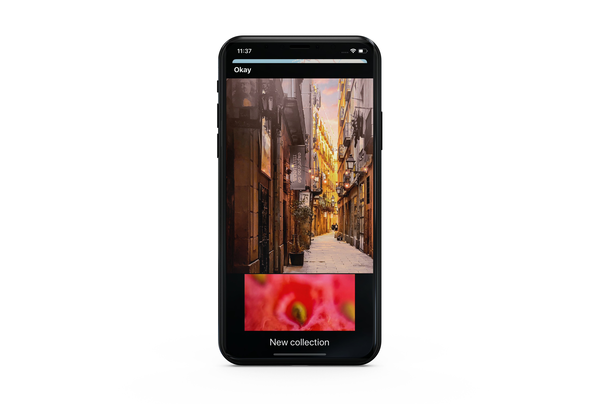
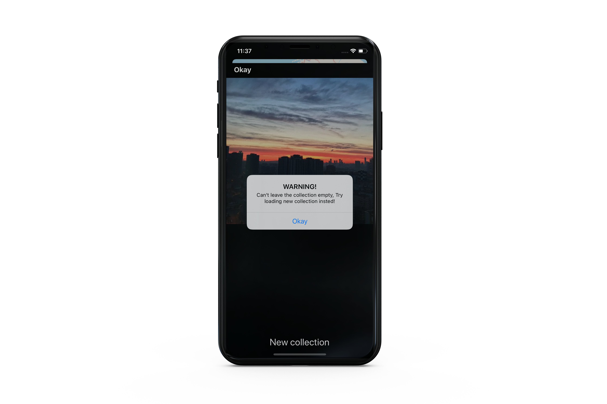

# Virtual-Tourist
 (Udacity iOS Developer Nanodegree.)
- The Virtual Tourist app utilizes Flickr API and Apple MapKit to let users download and store images from Flickr.com.
The app allows users to drop pins on a map, as if they were stops on a tour. Users will then be able to download pictures from Flicker for the location and persist both the pictures, and the association of the pictures with the pin coordinates.

## This project focused on
* Store media on the device file system.
* Use Core Data for local persistence of an object structure.
* Accessing networked data - Flicker API.
* Parsing JSON file using Codable (Decodable , Encodable).
* Creating user interfaces that are responsive using asynchronous requests.
* Use MapKit framework to display pins on a map.

## Map Screen
- Shows the map and allows user to drop pins around the world. 
- Users can add new pins by long press on the map. 
- As soon as a pin is dropped it is persisted and available on app relaunch, tapping the pin opens the Photo Album of that pin.

  

## Photo Album Screen
- By tapping any pin in the map, Images are fetched from memory. 
- If there's no images saved, a set of Images is downloded form Flicker.com with placeholder images displayed until the images finishes downloading. 
- The Data Model was implemented using Apple CoreData to persist the downloaded images in the app rather than downloading them each time the user launches the app.

  

- Users can delete photos from existing albums by tapping them, if user tries to delete all the images a warning is displayed
- The user has the ability to fetch a new collection of images by pressing the New Collection Button which deletes the existing images and fetches new ones.

  

## Dependencies:
* Apple UIKit
* Apple CoreData
* Apple MapKit
* Flickr API
